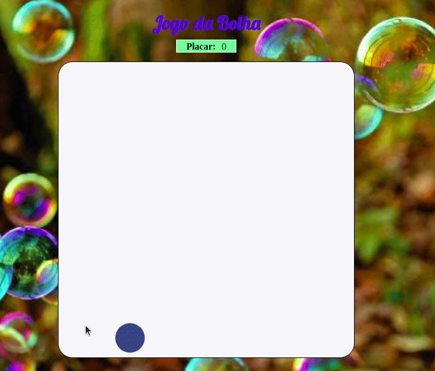

<h4 align="center">

Projeto jogo da bolha do curso da B7web.
Usando HTML,CSS e Javascript
</h4>

## :rocket: Tecnologias

Esse projeto foi desenvolvido com as seguintes tecnologias:

-  [HTML]
-  [Javascript]
-  [CSS]
-  [VS Code]
